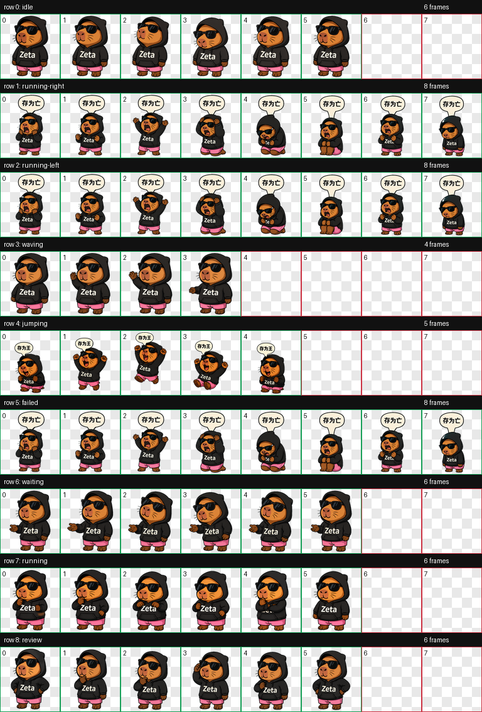

<div align="center">


# Zeta.skills

**戴墨镜写代码，穿粉裤去摸鱼。**

一只萌系 Q 版水豚 Codex 桌宠，以及负责安装它的轻量摸鱼 Skill。

[](https://github.com/Jray937/Zeta.skills)
[](zeta-moyu/SKILL.md)
[](https://raw.githubusercontent.com/Jray937/Zeta.skills/main/zeta-moyu.skill)

[快速安装](#快速安装) · [鼠标彩蛋](#鼠标彩蛋) · [动作预览](#动作预览) · [仓库内容](#仓库内容)

</div>

## 快速安装

把这一行直接发给 Codex：

```text
$skill-installer https://github.com/Jray937/Zeta.skills/tree/main/zeta-moyu
```

然后让 Zeta 上桌：

```text
$zeta-moyu 帮我配置 Zeta，然后陪我摸鱼
```

Skill 会把经过校验的 `pet.json` 和 `spritesheet.webp` 安装到 `~/.codex/pets/zeta/`。如果 Codex 已经打开，重新选择 Zeta 或重启 Codex 即可看到它。

也可以直接下载打包文件：[**zeta-moyu.skill**](https://raw.githubusercontent.com/Jray937/Zeta.skills/main/zeta-moyu.skill)。

## 鼠标彩蛋

| 鼠标动作 | Zeta 的反应 |
| --- | --- |
| **Hover** | 高兴到仿佛升天，浮夸大喊 **「存为王！」** |
| **左右拖拽** | 气愤、难过、失望到仿佛世界末日，大喊 **「存为亡！」** |

拖拽对应的动作行已经清除原跑步角色，不会出现两套动画重叠。

## 动作预览

<table>
  <tr>
    <td align="center"><br><strong>待机</strong></td>
    <td align="center"><br><strong>Hover · 存为王</strong></td>
    <td align="center"><br><strong>拖拽 · 存为亡</strong></td>
  </tr>
</table>

<details>
<summary><strong>查看完整动作图集</strong></summary>



</details>

## 这个 Skill 做什么

`zeta-moyu` 只做两件事：

1. 安装或恢复随包附带的 Zeta 桌宠。
2. 配置完成后，陪你说一句轻松、无害的摸鱼话。

它不会创建任务、提醒、研究流程或其他生产力功能。

## 仓库内容

```text
Zeta.skills/
├── zeta-moyu.skill              # 可直接下载的技能包
└── zeta-moyu/
    ├── SKILL.md                  # Skill 指令
    ├── agents/openai.yaml        # Codex 展示信息
    ├── scripts/install_zeta.py   # 安装与校验脚本
    └── assets/pet/
        ├── pet.json
        └── spritesheet.webp
```

安装器会核对资源完整性；若目标位置已经存在不同版本，还会先创建带时间戳的备份。

---

<div align="center">

**Zeta：今天的代码可以保存，今天的鱼也要摸。**

</div>
